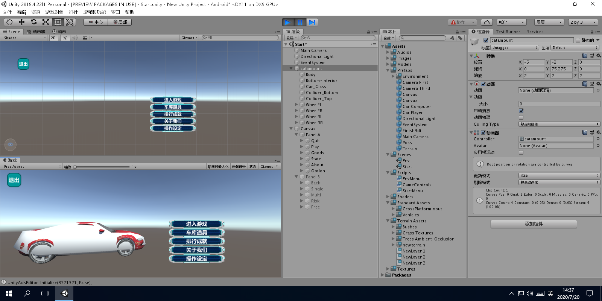
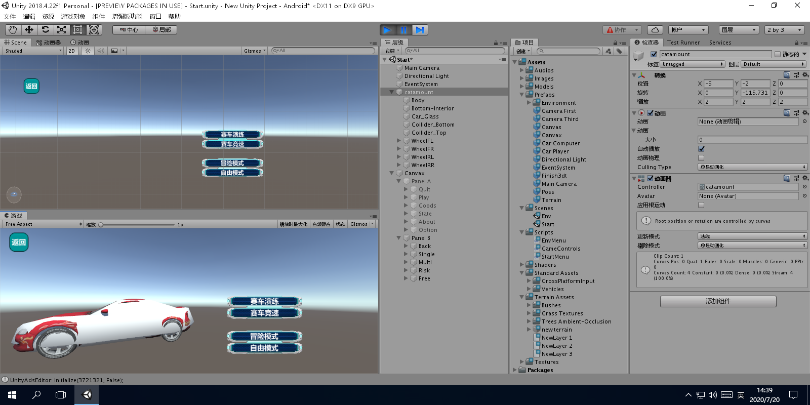
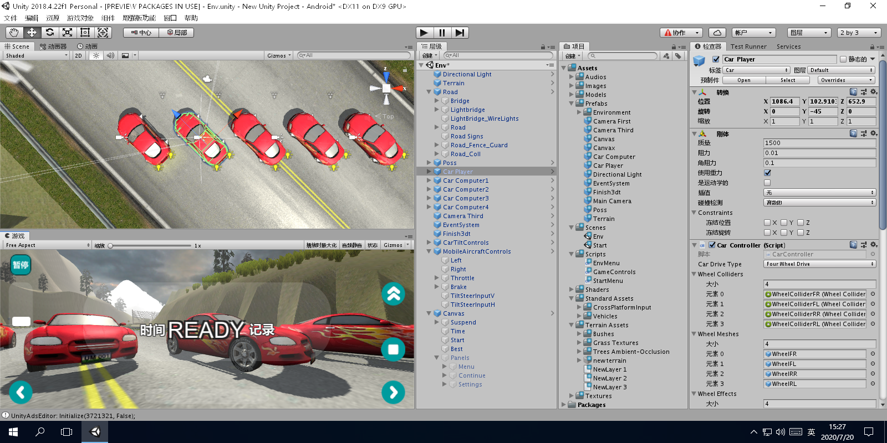
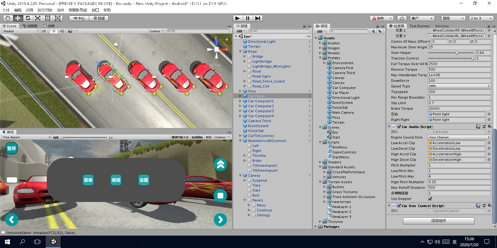

# RacingCars3d

赛车3dUnity游戏  

#### 集成环境

| 编辑器 | 版本 | 平台 |
| :-: | :-: | :-: |
| Unity Hub | v2.3.2 | Windows |
| Unity | v2018.4.22f1 | Windows x64 |
| Visual Studio Installer | v2.6.2037.624 | Windows |
| Visual Studio 2017 | v16.6.4 | Windows |

#### [Unity用户手册 (2018.4) - Unity手册](https://docs.unity.cn/cn/current/Manual/index.html)

#### 软件架构

├─LICENSE `许可证`
***
├─New Unity Project.sln `主程序`
├─Assembly-CSharp.csproj `装配C#`
├─Assembly-CSharp-firstpass.csproj `装配C#首次`
├─obj `对象`
|      ├─Debug `调试`
|      |   ├─.NETFramework,Version=v4.7.1.AssemblyAttributes.cs
|      |   ├─Assembly-CSharp-firstpass.csprojAssemblyReference.cache
|      |   ├─Assembly-CSharp.csprojAssemblyReference.cache
|      |   └DesignTimeResolveAssemblyReferencesInput.cache
├─Packages `包`
|      └manifest.json `显现`
├─Logs `日志`
|      └Packages-Update.log
├─ProjectSettings `项目设置`
|      ├─AudioManager.asset `音频管理器`
|      ├─ClusterInputManager.asset `群集输入管理器`
|      ├─DynamicsManager.asset `动态管理器`
|      ├─EditorBuildSettings.asset `编辑器建立设置`
|      ├─EditorSettings.asset `编辑器设置`
|      ├─GraphicsSettings.asset `图形设置`
|      ├─InputManager.asset `输入管理器`
|      ├─NavMeshAreas.asset `导航网格区`
|      ├─NetworkManager.asset `网络管理器`
|      ├─Physics2DSettings.asset `物理2D设置`
|      ├─PresetManager.asset `预设管理器`
|      ├─ProjectSettings.asset `项目设置`
|      ├─ProjectVersion.txt `项目版本`
|      ├─QualitySettings.asset `质量设置`
|      ├─TagManager.asset `标签管理器`
|      ├─TimeManager.asset `时间管理器`
|      ├─UnityConnectSettings.asset `Unity连接设置`
|      ├─UPRSettings.asset `UPR设置`
|      └VFXManager.asset `VFX管理器`
├─Library `库`
|      ├─assetDatabase3
|      ├─AssetImportState
|      ├─AnnotationManager
|      ├─BuildPlayer.prefs
|      ├─BuildSettings.asset
|      ├─CurrentLayout.dwlt
|      ├─CurrentMaximizeLayout.dwlt
|      ├─expandedItems
|      ├─InspectorExpandedItems.asset
|      ├─LibraryFormatVersion.txt
|      ├─LastSceneManagerSetup.txt
|      ├─MonoManager.asset
|      ├─ProjectSettings.asset
|      ├─shadercompiler-UnityShaderCompiler.exe0.log
|      ├─ScriptMapper
|      ├─SpriteAtlasDatabase.asset
|      ├─ShaderCache.db
|      ├─TilemapEditorUserSettings.asset
|      ├─metadata `元数据` └...
|      ├─ScriptAssemblies `脚本装配` └...
|      ├─TerrainTools `地形工具` └...
|      ├─ChinaEditorCache `中式编辑器缓存` └...
|      ├─PackageCache `包缓存` └...
|      ├─StateCache `状态缓存` └...
|      ├─ShaderCache `着色器缓存` └...
├─Assets `资源`
|      ├─x.meta
|      ├─Textures `纹理` └...
|      ├─Images `图像` └...
|      ├─Audios `音频` └...
|      ├─Models `模型` └...
|      ├─Shaders `着色器` └...
|      ├─Materials `材质球` └...
|      ├─Prefabs `预设体` └...
|      ├─Scripts `脚本`
|      |   ├─StartMenu.cs `开始菜单`
|      |   ├─EnvMenu.cs `环境菜单`
|      |   └GameControls.cs `游戏控制`
|      ├─Scenes `场景`
|      |   ├─Start.unity `开始`
|      |   └Env.unity `环境`
|      ├─Standard Assets `标准资源`
|      |   ├─Vehicles `车辆`
|      |   |   ├─Car `车` └...
|      |   ├─CrossPlatformInput `跨平台输入` └...
|      ├─Terrain Assets `地形资源`
|      |   ├─Trees Ambient-Occlusion `树荫` └...
|      |   ├─Bushes `灌木` └...
|      |   ├─Grass `草坪` └...
|      |   ├─NewLayer 1.terrainlayer `层 1`
|      |   ├─NewLayer 2.terrainlayer `层 2`
|      |   ├─NewLayer 3.terrainlayer `层 3`
|      |   └new terrain.asset `地形`
***
├─Start.unity `开始`
|      ├─Directional Light `方向光`
|      ├─Camera Main `摄像头主要`
|      ├─catamount `(山猫)车`
|      |   ├─Car_Glass `车窗户`
|      |   ├─Body `身部`
|      |   ├─Bottom-Interior `底内部`
|      |   ├─Collider_Top `碰撞器头`
|      |   ├─Collider_Bottom `碰撞器底`
|      |   ├─WheelFL `轮圆盘制动器正左` └DiscBrakeFL └WheelFL.2
|      |   ├─WheelFR `轮圆盘制动器正右` └DiscBrakeFR └WheelFR.2
|      |   ├─WheelRL `轮圆盘制动器反左` └DiscBrakeRL └WheelRL.2
|      |   └WheelRR `轮圆盘制动器反右` └DiscBrakeRR └WheelRR.2
|      ├─Canvax `画布`
|      |   ├─Panel A `面板 A`
|      |   |   ├─Quit `退出` └Text
|      |   |   ├─Play `进入游戏` └Text
|      |   |   ├─Goods `车库道具` └Text
|      |   |   ├─State `排行成就` └Text
|      |   |   ├─About `关于我们` └Text
|      |   |   └Option `操作设定` └Text
|      |   ├─Panel B `面板 B`
|      |   |   ├─Back `返回` └Text
|      |   |   ├─Single `赛车演练` └Text
|      |   |   ├─Multi `赛车竞速` └Text
|      |   |   ├─Risk `冒险模式` └Text
|      |   |   └Free `自由模式` └Text
|      └EventSystem `事件系统`
├─Env.unity `环境`
|      ├─Directional Light `方向光`
|      ├─Camera Third `摄像头第三人称`
|      ├─Finish3dt `终线`
|      ├─Terrain `地形`
|      ├─Road `道路`
|      |   ├─Bridge `桥`
|      |   ├─Lightbridge `发光桥`
|      |   |   ├─LightBridge_Inner `发光桥里边`
|      |   |   ├─LightBridge_Outer `发光桥外边`
|      |   |   └Lamps `灯`
|      |   ├─LightBridge_WireLights `发光桥电光`
|      |   ├─Road `路`
|      |   |   ├─Road01
|      |   |   ├─...
|      |   |   └Road03
|      |   ├─Road Signs `路标志`
|      |   ├─Road_Coll `路集合`
|      |   |   ├─Road_Coll01
|      |   |   ├─...
|      |   |   ├─Road_Coll03
|      |   |   ├─Road_Coll_Side01
|      |   |   ├─...
|      |   |   └Road_Coll_Side03
|      |   ├─Road_Fence_Guard `路护栏`
|      |   |   ├─RoadBlock `路障`
|      |   |   ├─PitFence `坑栏`
|      |   |   ├─GalleryFences `廊栏`
|      |   |   ├─Guards_Inner_Main `护栏里边主要`
|      |   |   | ├─Guards_Inner_Main01
|      |   |   | ├─...
|      |   |   | └Guards_Inner_Main04
|      |   |   ├─Guards_Inner_Rock_Slide `护栏里边摇摆次要`
|      |   |   | └Guards_Inner_Rock_Slide_ChainLinks
|      |   |   ├─Guards_Outer_Main `护栏外边主要`
|      |   |   | ├─Guards_Outer_Main01
|      |   |   | └Guards_Outer_Main02
|      |   |   ├─Guards Outer Stretch Base `护栏外边伸展基本`
|      |   |   | ├─Guards_Outer_Stretch_Pillars
|      |   |   | └Guards_Outer_Stretch_Fence_Detail
|      |   |   └Guards_Mission_Control_Base `护栏使命控制基本`
|      ├─Poss `导航点`
|      |   ├─poss101
|      |   ├─...
|      |   └poss124
|      ├─Car Player `车玩家`
|      |   ├─Car_Glass `车窗户`
|      |   ├─Body `身部`
|      |   ├─Bottom-Interior `底内部`
|      |   ├─Collider_Top `碰撞器顶`
|      |   ├─Collider_Bottom `碰撞器底`
|      |   ├─WheelFL `轮圆盘制动器正左` └DiscBrakeFL └WheelFL.2
|      |   ├─WheelFR `轮圆盘制动器正右` └DiscBrakeFR └WheelFR.2
|      |   ├─WheelRL `轮圆盘制动器反左` └DiscBrakeRL └WheelRL.2
|      |   ├─WheelRR `轮圆盘制动器反右` └DiscBrakeRR └WheelRR.2
|      |   ├─CarShadow `车阴影`
|      |   ├─CenterOfMass `重心`
|      |   ├─LeftSmoke (Missing Prefab) `左排气`
|      |   |   └Missing Prefab (Dummy)
|      |   ├─RightSmoke (Missing Prefab) `右排气`
|      |   |   └Missing Prefab (Dummy)
|      |   ├─Particles `粒子燃尽排气`
|      |   |   └ParticleBurnoutSmoke
|      |   ├─WheelColliders `轮碰撞器`
|      |   |   ├─WheelColliderFL
|      |   |   ├─WheelColliderFR
|      |   |   ├─WheelColliderRL
|      |   |   └WheelColliderRR
|      |   ├─Point light `点光源`
|      |   ├─Point light `点光源`
|      |   └Camera First `摄像头第一人称`
|      ├─Car Computer1 `车电脑1` └...
|      ├─Car Computer2 `车电脑2` └...
|      ├─Car Computer3 `车电脑3` └...
|      ├─Car Computer4 `车电脑4` └...
|      ├─CarTiltControls `车磁贴控制` └...
|      ├─MobileAircraftControls `移动舟控制` └...
|      ├─Canvas `画布`
|      |   ├─Time `所用时间`
|      |   ├─Start `READY-GO-OVER`
|      |   ├─Best `最高记录`
|      |   ├─Suspend `暂停`
|      |   |   └Text
|      |   ├─Panels `面板`
|      |   |   ├─Menu `菜单` └Text
|      |   |   ├─Continue `继续` └Text
|      |   |   └Settings `设置` └Text
|      └EventSystem `事件系统`

#### 运行结果

#### 安装教程

1.  xxxx
2.  xxxx
3.  xxxx

#### 使用说明

1.  xxxx
2.  xxxx
3.  xxxx

#### 参与贡献

1.  Fork 本仓库
2.  新建 Feat_xxx 分支
3.  提交代码
4.  新建 Pull Request
